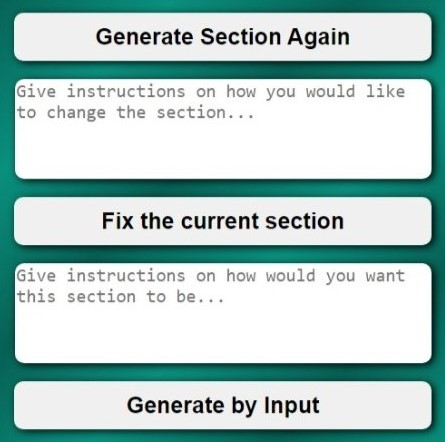

[![LinkedIn][linkedin-shield]][linkedin-url]
[![Apache License][license-shield]][license-url]
[![X][X-sheild]][X-url]


<p align="center">
  <a href="#video-">View Video</a>
    ·
  <a href="https://github.com/Elio-Aliaj/Automated-Website-and-CMS/issues">Report Bug</a>
    ·
  <a href="https://github.com/Elio-Aliaj/Automated-Website-and-CMS/issues">Request Feature</a>
</p>

<details>
  <summary>Table of Contents 📋</summary>
  <ol>
    <li>
      <a href="#about-the-project-">About The Project 🌱</a>
      <ul>
        <li><a href="#key-features-">Key Features 🔑</a></li>    
        <li><a href="#technology-stack-">Technology Stack 🧑‍💻</a></li>
      </ul>
    </li>
    <li>
      <a href="#getting-started-">Getting Started 🏁</a>
      <ul>
        <li><a href="#prerequisites-">Prerequisites 📦</a></li>
        <li><a href="#installation-%EF%B8%8F">Installation ⬇️</a></li>
        <li><a href="#running-aw--cms-">Running AW & CMS 🚀</a>
          <ul>
        <li><a href="#configuration-%EF%B8%8F">Configuration ⚙️</a>
        <li><a href="#running-%EF%B8%8F">Running 🏃‍♂️</a>
        <li><a href="#generated-website-files-%EF%B8%8F">Generated Website Files ♻️</a>
          </ul>
        </li>
      </ul>
    </li>
    <li><a href="#usage-%EF%B8%8F">Usage 🛠️</a>
      <ul>
        <li><a href="#video-">View Video 🎬</a></li>
        <li><a href="#screenshot-">Screenshot 📸</a></li>
      </ul>
    </li>
    <li><a href="#license-">License 🪪</a></li>
    <li><a href="#contact-">Contact 📞</a></li>
  </ol>
</details>

## About The Project 🌱


Automated-Website-and-CMS is a powerful tool designed to simplify website creation without the need for coding. This project empowers users to effortlessly generate personalized websites by filling out a simple form

### Key Features 🔑

- **Form-Based Website Creation**: Easily create websites by providing information through a straightforward form

- **Dynamic Customization**: Once the website is generated, users have three flexible options for customizing segments:

  1. **Regenerate Segments**: Update segments based on the information initially provided in the form

  2. **Interactive Fixes**: Users can choose to fix a segment by providing specific instructions. This information, combined with the segment code, is sent to ChatGPT 3.5 Turbo for intelligent adjustments

  3. **Instruction-Only**: Users can instruct ChatGPT 3.5 Turbo on changes without providing the existing segment code, allowing for complete freedom in designing the section

### Technology Stack 🧑‍💻

- [![HTML5][HTML5-sheild]][HTML5-url]
- [![CSS3][CSS3-sheild]][CSS3-url]
- [![SCSS][SCSS-sheild]][SCSS-url]
- [![JavaScript][JavaScript-sheild]][JavaScript-url]
- [![NodeJs][NodeJs-sheild]][NodeJs-url]
- [![Json-Server][Json-Server-sheild]][Json-Server-url]
- [![GPT3.5][GPT3.5-sheild]][GPT3.5-url]
- [![Dall-e][Dall-e-sheild]][Dall-e-url]

## Getting Started 🏁

### Prerequisites 📦

Before getting started, ensure you have the necessary prerequisites:

- **API Key from OpenAI:** Register for an account on OpenAI and obtain your API key. You'll need this key to leverage the power of ChatGPT 3.5 Turbo for advanced segment adjustments and personalized transformations. Visit [OpenAI](https://openai.com/blog/openai-api) to get your API key

- **Node.js:** Make sure you have Node.js installed. If not, you can download and install it from [Node.js](https://nodejs.org/en)

### Installation ⬇️

1. Clone the repository

   ```bash
   git clone https://github.com/Elio-Aliaj/Automated-Website-and-CMS.git
   ```

2. Install packages

   ```powershell
   cd .\Automated-Website-and-CMS\
   ```

   ```powershell
   npm install
   ```

### Running AW & CMS 🚀

#### Configuration ⚙️

1. In the main project folder (Automated-Website-and-CMS), locate the `.env.example` file
2. Rename it to `.env`
3. Open the `.env` file:
   - Replace `ID` with your actual OpenAI API Organization Id.
   - Replace `KEY` with your actual OpenAI API Key.

#### Running 🏃‍♂️

1.  Run Json Server

    ```powershell
    cd .\Automated-Website-and-CMS\Data\
    ```

    ```powershell
    npx json-server --watch db.json --port 8000
    ```

    <details>
    <summary>
    This will be shown in the console:
    </summary>
    <code>
        
        \{^_^}/ hi!

        Loading db.json
        Done

        Resources
        http://localhost:8000/formData
        http://localhost:8000/response

        Home
        http://localhost:8000

        Type s + enter at any time to create a snapshot of the database
        Watching...

    </code>
    </details>

####

2.  Run NodeJS

    ```powershell
    cd '.\Automated-Website-and-CMS\AI Caller\'
    ```

    ```powershell
    node .\AI_Caller.js
    ```

    <details>
    <summary>
    This will be shown in the console:
    </summary>
    <code>
        
        Server listening at http://localhost:3000

    </code>
    </details>

####

`Keep this console in view, because it will update you with any changes made to the website or inform for any errors`

3.  Open the Form

    - Navigate to the `.\Automated-Website-and-CMS\Form UI` directory.
    - Locate the `User_interface.html` file and open it in your preferred web browser.
    - The form UI will guide you through the process of filling out the necessary information to generate your initial website.

    <details>
    <summary>
    This Form will show up on a website:
    </summary>
    
    </details>

####

4.  Customize the Website

    - When hovering over every section with the mouse, a gear ⚙️ icon will appear. Clicking the gear icon presents three ways of modifying the website:

      1. **Generate Section Again:**

         - This option will regenerate the current section with the data from the initial form.

      2. **Fix the Current Section:**

         - Choose this option to fix the current segment by providing instructions on how you want the segment to change. The provided instructions, combined with the segment code, are sent to ChatGPT 3.5 Turbo. After processing, ChatGPT 3.5 Turbo makes the necessary changes and returns the updated code.

      3. **Generate by Input:**

         - Users can provide instructions to ChatGPT 3.5 Turbo for changes without providing the existing segment code. This allows for complete freedom in designing the section.

        <details>
        <summary>
        This will show up:
        </summary>
        
        </details>

          ⚠️ Do not make more than one change at a time otherwise you will get an 🛑 Error 429 🛑

####

#### Generated Website Files ♻️

After completing the website generation process, you can find all the generated files and images in `.\Automated-Website-and-CMS\Gen_Websit` directory:

- Navigate to this directory to access and manage the files created during the website generation. You'll find the components, pages, and images that make up your personalized website.

- Feel free to explore and make further customizations if needed. If you have any questions or encounter issues, please refer to the documentation or reach out to the project's support channels.
   <details>
  <summary>
   To remove Gear Icon ⚙️:
   </summary>

  - In the end of the `Gen_Web.html` file you should delete this lines:

     <code>

    ```html
    <!-- Your can delete from HERE to... -->
    <script src="../Edit_Website/Edit.js"></script>
    <script type="module">
      const socket = new WebSocket("ws://localhost:3000");
      socket.onmessage = (event) => {
        if (event.data === "reload") {
          location.reload();
        }
      };
    </script>
    <!-- ...to HERE after you are done with the website creation-->
    ```

     </code>
    </details>

## Usage 🛠️

### Video 🎬

https://github.com/Elio-Aliaj/Automated-Website-and-CMS/assets/119447071/13fdc1fa-43c7-423a-9f14-4427462cd6c7

### Screenshot 📸

<details>
<summary>
Here are some examples:
</summary>


</details>

## License 🪪

[![Apache License][license-shield]][license-url]

©️ Copyright 2023 Elio Aliaj <elio.aliaj0@gmail.com>

Licensed under the Apache License, Version 2.0 (the "License");
you may not use this file except in compliance with the License.
You may obtain a copy of the License at

http://www.apache.org/licenses/LICENSE-2.0

Unless required by applicable law or agreed to in writing, software
distributed under the License is distributed on an "AS IS" BASIS,
WITHOUT WARRANTIES OR CONDITIONS OF ANY KIND, either express or implied.
See the License for the specific language governing permissions and
limitations under the License.

## Contact 📞

[![Gmail][Gmail-sheild]][Gmail-url]
[![LinkedIn][linkedin-shield]][linkedin-url]
[![X][X-sheild]][X-url]
[![GitHub][GitHub-sheild]][GitHub-url]

<!-- Links & Logos -->

[linkedin-shield]: https://img.shields.io/badge/LinkedIn-%230A66C2?style=for-the-badge&logo=linkedin
[linkedin-url]: https://www.linkedin.com/in/elio-aliaj-48084a255/
[license-shield]: https://img.shields.io/github/license/Elio-Aliaj/Automated-Website-and-CMS?style=for-the-badge&logo=Apache&logoColor=%23D22128&color=%23D22128
[license-url]: https://github.com/Elio-Aliaj/Automated-Website-and-CMS/blob/main/LICENSE.md
[X-sheild]: https://img.shields.io/badge/Elio%20Aliaj-%23000000?style=for-the-badge&logo=x&labelColor=%23000000
[X-url]: https://twitter.com/Elio_Aliaj
[HTML5-sheild]: https://img.shields.io/badge/HTML5-E34F26?style=for-the-badge&logo=html5&logoColor=%23fff
[HTML5-url]: https://en.wikipedia.org/wiki/HTML5
[CSS3-sheild]: https://img.shields.io/badge/CSS3-1572B6?style=for-the-badge&logo=CSS3
[CSS3-url]: https://css3.com/
[SCSS-sheild]: https://img.shields.io/badge/SCSS-CC6699?style=for-the-badge&logo=sass&logoColor=%23fff
[SCSS-url]: https://sass-lang.com/documentation/syntax/
[JavaScript-sheild]: https://img.shields.io/badge/Javascript-F7DF1E?style=for-the-badge&logo=javascript&logoColor=%23fff
[JavaScript-url]: https://www.javascript.com/
[NodeJs-sheild]: https://img.shields.io/badge/Node.js-339933?style=for-the-badge&logo=nodedotjs&logoColor=%23fff
[NodeJs-url]: https://nodejs.org/en
[GPT3.5-sheild]: https://img.shields.io/badge/Chat%20GPT%203.5%20Turbo-412991?style=for-the-badge&logo=openai&logoColor=%23fff&label=Open%20ai
[GPT3.5-url]: https://openai.com/chatgpt
[Dall-e-sheild]: https://img.shields.io/badge/Dall--e%202-412991?style=for-the-badge&logo=openai&logoColor=%23fff&label=Open%20AI
[Dall-e-url]: https://openai.com/dall-e-2
[Json-Server-sheild]: https://img.shields.io/badge/Json%20Server-%23339933?style=for-the-badge&logo=npm&logoColor=%23fff&label=Npm&labelColor=%23CB3837
[Json-Server-url]: https://www.npmjs.com/package/json-server
[Gmail-sheild]: https://img.shields.io/badge/Gmail-%23EA4335?style=for-the-badge&logo=gmail&labelColor=%23fff
[Gmail-url]: mailto:elioaliaj0@gmail.com
[GitHub-sheild]: https://img.shields.io/badge/GitHub-%23181717?style=for-the-badge&logo=github
[GitHub-url]: https://github.com/Elio-Aliaj
